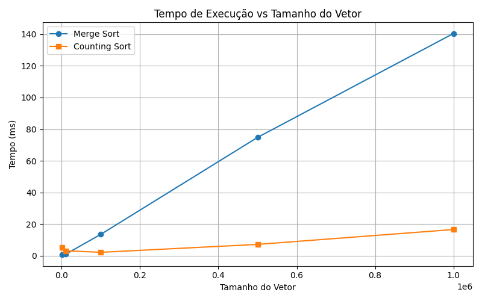
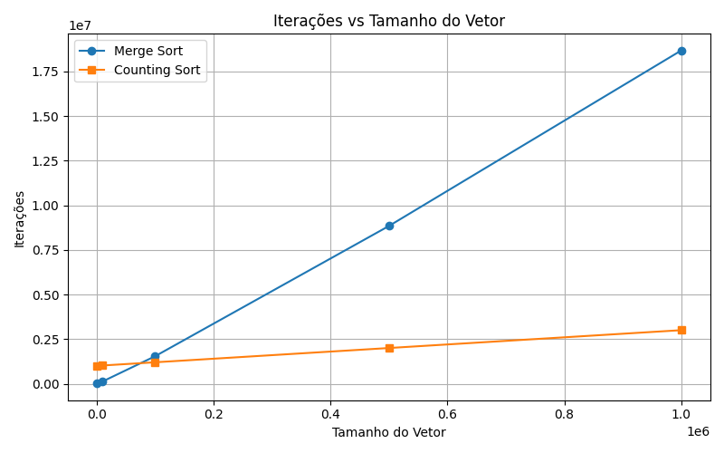
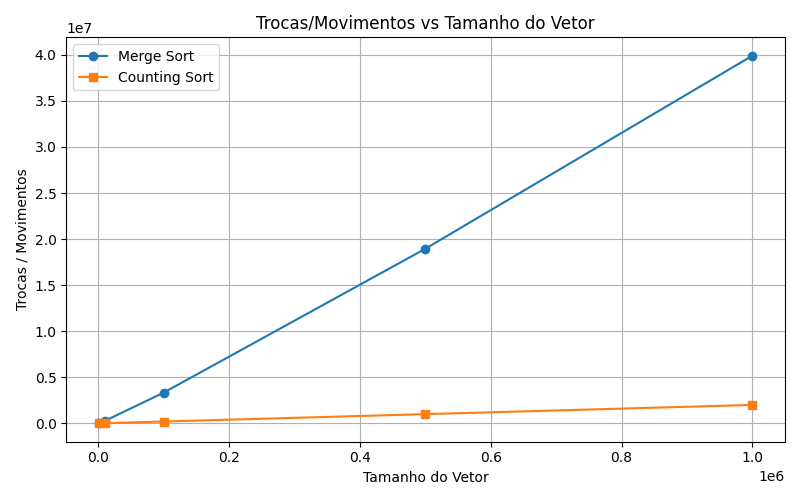

# Análise Comparativa de Algoritmos de Ordenação - Relatório
## Merge Sort vs. Counting Sort

Aluno: Guilherme Tuchanski Rocha

## 1. Introdução
A ordenação de dados é uma das operações mais fundamentais e estudadas na ciência da computação. A eficiência com que um conjunto de dados é ordenado pode impactar drasticamente o desempenho de um sistema.

Este trabalho se propõe a investigar na prática as diferenças de desempenho entre duas abordagens. Para isso, realizei uma análise comparativa entre o Merge Sort, um clássico algoritmo de comparação, e o Counting Sort, um algoritmo de distribuição. O estudo mede e compara três métricas chave — tempo de execução, número de iterações e quantidade de trocas/movimentos.

## 2. Metodologia
### 2.1. Ambiente
O experimento foi conduzido utilizando a linguagem Java. As medições de tempo de execução de cada algoritmo foram realizadas através da função System.currentTimeMillis().

Os gráficos apresentados foram gerados em Python, utilizando a biblioteca Matplotlib, a partir dos resultados coletados pelo programa _Main.java_ e consolidados no arquivo _graficos/resultado_main.csv_. O código para a visualização está disponível em _graficos/gerar_graficos.py_.

### 2.2. Estrutura de Dados
A estrutura de dados base para todos os testes foi o vetor de inteiros (int[]). Para cada cenário de teste, os vetores foram preenchidos com números inteiros gerados aleatoriamente, dentro de um intervalo pré-definido, para criar um conjunto de dados não ordenado.

### 2.3. Algoritmos Avaliados
Para representar as duas principais categorias de ordenação, foram implementados e avaliados os seguintes algoritmos:

#### 2.3.1. Merge Sort
O Merge Sort é um algoritmo de ordenação por comparação. Ele, de maneira recursiva, divide o vetor ao meio até que cada subvetor contenha um único elemento e, em seguida, mescla os subvetores ordenados para produzir o vetor final ordenado. 

#### 2.3.2. Counting Sort
O Counting Sort é um algoritmo de ordenação de distribuição. Ele opera contando o número de ocorrências de cada elemento no vetor de entrada e utiliza essas contagens para determinar a posição de cada elemento no vetor de saída.

### 2.4. Geração dos Dados
Os testes foram executados com vetores de cinco tamanhos diferentes: 1.000, 10.000, 100.000, 500.000 e 1.000.000 de elementos.

Cada análise foi realizada em 5 rodadas. Em cada rodada, uma seed aleatória foi gerada e utilizada para criar o vetor de dados. Essa mesma seed foi usada para gerar o vetor para ambos os algoritmos (Merge Sort e Counting Sort), assegurando que eles operaram sobre um conjunto de dados inicial idêntico em cada rodada.

## 3. Resultados
Nesta seção, são apresentados os dados coletados nos experimentos, seguidos pela análise de cada métrica de desempenho.

### 3.1. Dados Compilados
As tabelas a seguir consolidam os resultados médios obtidos para cada métrica após a execução dos algoritmos em vetores de diferentes dimensões.

**Tabela 1: Tempo de Execução (ms)**
| Tamanho do Vetor | Merge Sort | Counting Sort |
|------------------|------------|---------------|
| 1.000            | 0.6        | 5.4           |
| 10.000           | 1.0        | 3.2           |
| 100.000          | 13.6       | 2.2           |
| 500.000          | 74.8       | 7.2           |
| 1.000.000        | 140.4      | 16.6          |

**Tabela 2: Número de Iterações**
| Tamanho do Vetor | Merge Sort   | Counting Sort |
|------------------|--------------|---------------|
| 1.000            | 8.722        | 1.002.000     |
| 10.000           | 120.458      | 1.020.000     |
| 100.000          | 1.536.281    | 1.200.000     |
| 500.000          | 8.836.864    | 2.000.000     |
| 1.000.000        | 18.674.178   | 3.000.000     |

**Tabela 3: Trocas / Movimentos**
| Tamanho do Vetor | Merge Sort   | Counting Sort |
|------------------|--------------|---------------|
| 1.000            | 19.952       | 2.000         |
| 10.000           | 267.232      | 20.000        |
| 100.000          | 3.337.856    | 200.000       |
| 500.000          | 18.951.424   | 1.000.000     |
| 1.000.000        | 39.902.848   | 2.000.000     |

### 3.2. Análise dos Resultados

#### 3.2.1. Análise do Tempo de Execução
O gráfico "Tempo de Execução vs Tamanho do Vetor" demonstra que o desempenho temporal dos algoritmos varia significativamente com a escala dos dados. Para entradas de menor dimensão (1.000 elementos), o Merge Sort apresenta uma ligeira vantagem. Contudo, à medida que o tamanho do vetor aumenta, seu tempo de execução cresce de forma exponencial, o que é consistente com sua complexidade de tempo algorítmica de O(n log n). Em contrapartida, o Counting Sort, apesar de um início ligeiramente mais lento, mantém um crescimento de tempo muito mais contido e escalável, apresentando um desempenho superior para grandes volumes de dados. Este comportamento reflete sua complexidade linear, que se mostra mais eficiente para as massas de dados maiores.

_Gráfico 1: Comparativo de Tempo de Execução vs. Tamanho do Vetor._

#### 3.2.2. Análise do Número de Iterações
A análise do número de iterações revela uma distinção clara na complexidade operacional dos algoritmos. O número de iterações do Merge Sort cresce a uma taxa acentuadamente maior em comparação com o Counting Sort. O gráfico ilustra que, para um vetor de 1.000.000 de elementos, o Merge Sort executa uma ordem de magnitude de iterações superior à do Counting Sort. Este último exibe um crescimento linear no número de operações, o que corrobora sua eficiência teórica e o torna um algoritmo menos custoso computacionalmente para conjuntos de dados extensos.

_Gráfico 2: Comparativo de Iterações vs. Tamanho do Vetor._

#### 3.2.3. Análise de Trocas e Movimentos de Elementos
O Merge Sort, por ser um algoritmo baseado em comparação e divisão, necessita de um número expressivo de movimentações de elementos para alcançar a ordenação. Em contraste, o Counting Sort se destaca por sua eficiência nesta métrica. Sua metodologia, que se baseia na contagem da frequência dos elementos para determinar suas posições finais, minimiza drasticamente a necessidade de movimentação de dados. A disparidade observada demonstra que o Counting Sort possui um custo de manipulação de dados consideravelmente menor, o que é uma vantagem crucial em sistemas onde a movimentação de memória é uma operação custosa.

_Gráfico 3: Comparativo de Trocas/Movimentos vs. Tamanho do Vetor._

## 4. Conclusão
Após a análise dos resultados, fica evidente a distinção de desempenho entre as duas abordagens de ordenação. O Merge Sort, embora eficaz, demonstra um custo computacional que escala de forma log-linear (O(n log n)), tornando-se progressivamente mais lento e intensivo em operações à medida que o volume de dados aumenta.

Em contrapartida, o Counting Sort prova ser uma solução extremamente eficiente para este cenário, com um desempenho superior em todas as métricas avaliadas para grandes conjuntos de dados. Sua complexidade linear (O(n+k)) resulta em menor tempo de execução, número de iterações e, de forma mais impactante, uma quantidade drasticamente inferior de movimentações de dados.

Portanto, a escolha do algoritmo de ordenação deve considerar a escala dos dados. Enquanto o Merge Sort é um algoritmo genérico e robusto, para cenários com grandes volumes de dados onde a natureza dos elementos permite (números inteiros dentro de um intervalo conhecido), o Counting Sort se torna uma alternativa significativamente mais performática.